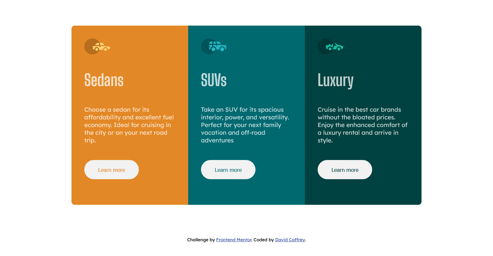

# Frontend Mentor - 3-column preview card component solution

This is a solution to the [3-column preview card component challenge on Frontend Mentor](https://www.frontendmentor.io/challenges/3column-preview-card-component-pH92eAR2-). Frontend Mentor challenges help you improve your coding skills by building realistic projects. 

## Table of contents

- [Overview](#overview)
  - [The challenge](#the-challenge)
  - [Screenshot](#screenshot)
  - [Links](#links)
- [My process](#my-process)
  - [Built with](#built-with)
- [Author](#author)

## Overview
A simple 3 card component

### The challenge

Users should be able to:

- View the optimal layout depending on their device's screen size
- See hover states for interactive elements

### Screenshot

### Links

- Solution URL: [Code on Github](https://github.com/DavidCaffrey/3-column-preview-card)
- Live Site URL: [Live site on Netlify](https://3-column-preview-card-caffrey.netlify.app/)

## My process
I started from a mobile first responsive view by structuring with semantic HTML and usgin flexbox to layout components. Then I added a small number of media queries for the desktp version.

### Built with

- Semantic HTML5 markup
- CSS custom properties
- Flexbox
- Mobile-first workflow

## Author

- Website - [David Caffrey website](https://www.caffreymedia.com)
- Frontend Mentor - [David Caffrey](https://www.frontendmentor.io/profile/DavidCaffrey)

